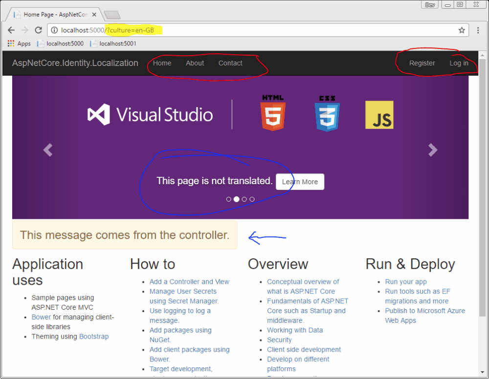

# ASP.NET Core Identity Localization

A localization library for [ASP.NET Core Identity](https://github.com/aspnet/Identity). You can copy&paste all resource files to get started with English and German. 
This library is based on the VS 2017 template and only edited for localization.   

Use this project to see how...
- View Localization 
- Controller Localization
- ViewModel Localization via DataAnnotations*

... works. For general information goto [here](https://docs.microsoft.com/en-us/aspnet/core/fundamentals/localization).  

*From the docs: In ASP.NET Core MVC 1.1.0 and higher, non-validation attributes are localized. ASP.NET Core MVC 1.0 does not look up localized strings for non-validation attributes.

### Screenshot


### Changes to VS 2017 templates

Besides the `@Localizer["key"]` changes within the views only the ViewModel of `LoginViewModel.cs` has been changed: a `Username` property has been added. You can delete the `Username` or `Email` property to fit you needs.

### Startup.cs

Next to the identity services and MVC you need to add localization:

```
public void ConfigureServices(IServiceCollection services)
{
    services.AddLocalization(s => s.ResourcesPath = "Resources");
    var supportedCultures = new CultureInfo[]
    {
        new CultureInfo("de-CH"),
        new CultureInfo("en-GB"),
    };

    services.Configure<RequestLocalizationOptions>(s =>
    {
        s.SupportedCultures = supportedCultures;
        s.SupportedUICultures = supportedCultures;
        s.DefaultRequestCulture = new RequestCulture(culture: "de-CH", uiCulture: "de-CH");
    });

    services.AddMvc()
        .AddViewLocalization(LanguageViewLocationExpanderFormat.Suffix)
        .AddDataAnnotationsLocalization();
}
```

Important to note is the `.AddViewLocalization(...)` and `.AddDataAnnotationLocalization()`.

Now the services need to be added to the pipeline:
```
public void Configure(IApplicationBuilder app, IHostingEnvironment env, ILoggerFactory loggerFactory)
{
    // ... abbreviated

    app.UseStaticFiles();

    // Using localization 
    var locOptions = app.ApplicationServices.GetService<IOptions<RequestLocalizationOptions>>();
    app.UseRequestLocalization(locOptions.Value);

    app.UseIdentity();
    app.UseMvc(routes =>
    {
        routes.MapRoute(
            name: "default",
            template: "{controller=Home}/{action=Index}/{id?}");
    });
}
```

### Folder Structure

As configured in Startup.cs MVC expects the resource files to be in the folder `Resources` with the following structure
```
Resources
|
|--Controllers (convention: fix, for Controller Localization)
|       HomeController.{culture}.resx
|       OtherController.{culture}.resx
|       ...
|
|--Models (convention: namespace, depending on the namespace of your models!!)
|   |
|   |--AccountViewModels
|   |       LoginViewModel.{culture}.resx 
|   |        ...
|   |
|   |--ManageViewModels
|   |        AddPhoneNumberViewModel.{culture}.resx 
|   |        ...
|  
|--Views (convention: fix)
|   |
|   |--Account
|   |        Login.{culture}.resx
|   |        ...
|   |
|   |--Manage
|   |        ManageLogins.{culture}.resx
|   |        ...
|   |
|   |--Your views...
...
```

### Controller Localization

You may inject then a `IStringLocalizer<...>` into for example the `HomeController` to use it.

```
public class HomeController : Controller
{
    private readonly IStringLocalizer<HomeController> _stringLocalizer;

    public HomeController(IStringLocalizer<HomeController> stringLocalizer)
    {
        _stringLocalizer = stringLocalizer;
    }

    public IActionResult Index()
    {
        ViewBag.MessageFromController = _stringLocalizer["This message comes from the controller."];
        return View();
    }
}
```

The injected StringLocalizer looks in the path declared in `Startup.cs` for a resource file named `HomeController.{culture}.resx`. 

### View Localization
In order for view localization to work you have to inject a IViewLocalizer. The easiest way is to add it to `_ViewImports.cshtml`:
```
@using AspNetCore.Identity.Localization
@using AspNetCore.Identity.Localization.Models
@using AspNetCore.Identity.Localization.Models.AccountViewModels
@using AspNetCore.Identity.Localization.Models.ManageViewModels
@using Microsoft.AspNetCore.Identity

@*Adding Localization*@
@using Microsoft.AspNetCore.Mvc.Localization
@inject IViewLocalizer Localizer

@addTagHelper *, Microsoft.AspNetCore.Mvc.TagHelpers

```

### Edit the Resource Files

When working with resource files `.resx` I strongly reccommend the `ResX Resource Manager` plugin for Visual Studio from Tom Englert. You find it in the [Market Place](https://marketplace.visualstudio.com/items?itemName=TomEnglert.ResXManager).

### How to Contribute

Feel free to add additional languages. :)
For details see [contributing](./CONTRIBUTING.md).

